python main_option2_all_etfs_v5_16_score_tilted_cvar_production_with_attribution.py

python explain_v516_allocation_fixed.py \
  --output-dir outputs_option2_v5_16_score_tilted_cvar \
  --window 2023 \
  --zip
  


Below is a clean explanation of **V5.16 production script** using block and sequence diagrams.

You can paste the Mermaid diagrams into a Mermaid viewer such as `mermaid.live`.

---

# 1. V5.16 high-level block diagram

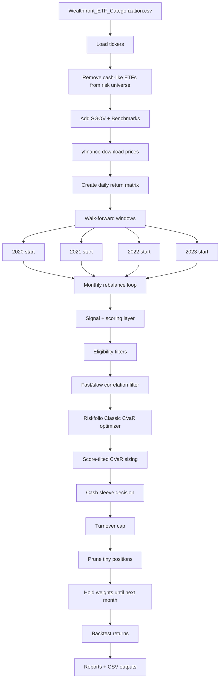

## Plain-English explanation

V5.16 does this:

```text
1. Read ETF universe from the Wealthfront CSV.
2. Remove SGOV/cash-like ETFs from the risk universe.
3. Add SGOV separately as the cash sleeve.
4. Add SPY, QQQ, VTI for benchmark reporting.
5. Download prices from yfinance.
6. Convert prices into daily returns.
7. For each walk-forward start year, run a monthly rebalance backtest.
8. At each rebalance date:
   - score ETFs,
   - filter weak ETFs,
   - remove highly correlated duplicates,
   - optimize the selected basket with Riskfolio CVaR,
   - tilt weights toward higher-scoring ETFs,
   - add SGOV if risk/cash rules require it,
   - cap turnover,
   - prune small positions,
   - hold until next monthly rebalance.
```

---

# 2. Input and data-download flow

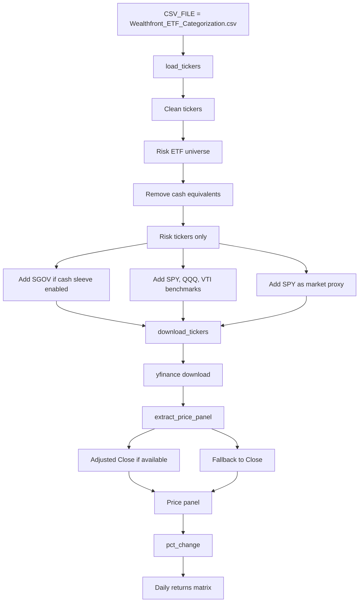

## Important point

The script uses:

```python
prices = download_prices(...)
base_returns = prices.pct_change(fill_method=None)
```

So all later indicators are derived from **return-based pseudo-prices**, not directly from OHLC data.

V5.16 does **not** use:

```text
high / low / ATR / NATR
```

That was only in the V5.17 experiment.

---

# 3. Walk-forward structure

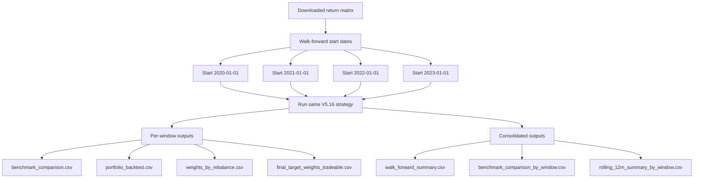

## Why walk-forward matters

The strategy is not judged from only one start date. It runs from:

```text
2020
2021
2022
2023
```

This checks whether the strategy survives multiple market regimes.

---

# 4. Monthly rebalance sequence

```mermaid
sequenceDiagram
    participant Main as main()
    participant Data as Returns Matrix
    participant Loop as Monthly Rebalance Loop
    participant Signal as Signal/Scoring Layer
    participant Filter as Eligibility + Correlation Filter
    participant Riskfolio as Riskfolio Optimizer
    participant Cash as Cash Sleeve
    participant Turnover as Turnover Control
    participant Backtest as Forward Return Engine
    participant Reports as Output Reports

    Main->>Data: Load daily returns
    Main->>Loop: Run each walk-forward window

    loop Each month-start rebalance date
        Loop->>Data: Get returns up to rebalance date
        Loop->>Data: Use last 189 trading days as lookback
        Loop->>Signal: Compute ETF scores
        Signal->>Filter: Apply trend/momentum/volatility filters
        Filter->>Filter: Apply fast/slow correlation filter
        Filter->>Riskfolio: Send selected ETF basket
        Riskfolio->>Riskfolio: Classic CVaR Sharpe optimization
        Riskfolio->>Riskfolio: Apply score-rank tilt
        Riskfolio->>Cash: Send optimized risk weights
        Cash->>Cash: Determine SGOV cash weight
        Cash->>Turnover: Create target final weights
        Turnover->>Turnover: Apply 20% turnover cap
        Turnover->>Turnover: Prune tiny positions
        Turnover->>Backtest: Final weights for next month
        Backtest->>Backtest: Apply weights until next rebalance
    end

    Backtest->>Reports: Build equity curve and performance stats
    Reports->>Reports: Save CSV outputs
```

---

# 5. Technical indicators used

V5.16 uses these indicators in the scoring layer.

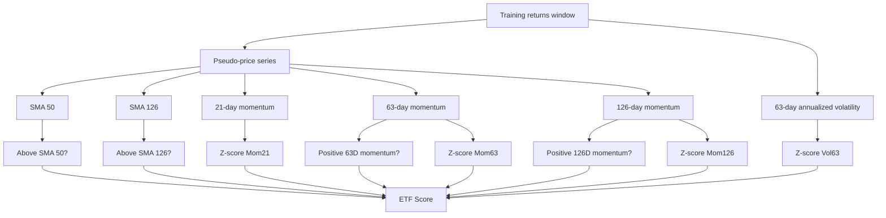

## Score formula

The script scores each ETF roughly like this:

```text
Score =
  2.00 × AboveSMA50
+ 3.00 × AboveSMA126
+ 2.50 × PositiveMom63
+ 3.50 × PositiveMom126
+ 1.50 × ZScore(Mom21)
+ 2.50 × ZScore(Mom63)
+ 3.50 × ZScore(Mom126)
- 2.00 × ZScore(Vol63)
```

So it prefers ETFs with:

```text
Positive trend
Positive medium-term momentum
Positive longer-term momentum
Lower realized volatility
```

---

# 6. ETF selection flow

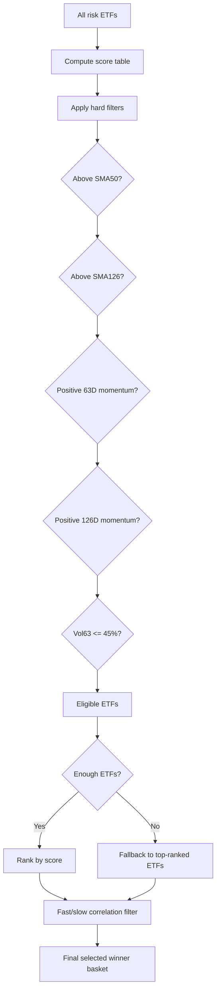

## Selection rules

V5.16 requires:

```text
Price above SMA50
Price above SMA126
63-day momentum positive
126-day momentum positive
63-day annualized volatility <= 45%
```

Then it chooses roughly:

```text
Minimum selected ETFs: 10
Maximum selected ETFs: 15
Max individual risk ETF weight: 12%
```

---

# 7. Fast/slow correlation filter

This is the V5.14 improvement that V5.16 keeps.

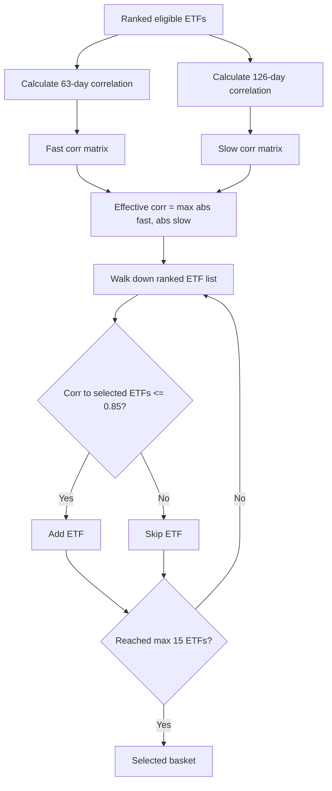

## Why this matters

This prevents the portfolio from becoming one crowded trade.

Example: if several tech/semiconductor ETFs score highly, the correlation filter tries to avoid owning too many nearly identical exposures.

V5.16 uses:

```python
effective_corr = max(abs(corr_63), abs(corr_126))
```

That means an ETF can be rejected if it is highly correlated over either:

```text
recent 63-day window
or
slower 126-day window
```

---

# 8. Riskfolio optimization flow

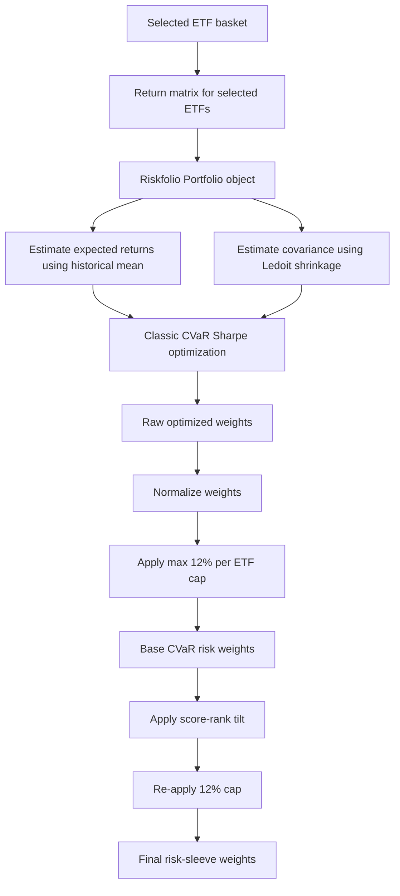

## Riskfolio settings

V5.16 uses:

```python
model = "Classic"
rm = "CVaR"
obj = "Sharpe"
method_mu = "hist"
method_cov = "ledoit"
upperlng = 0.12
```

Meaning:

```text
Classic optimizer
CVaR risk measure
Sharpe objective
Historical mean returns
Ledoit covariance shrinkage
No shorting
Max 12% per ETF
```

## Important note

The script still contains `build_momentum_views()`, but **V5.16 does not use Black-Litterman**.

That function is dead code in V5.16.

Instead, V5.16 uses this practical bridge:

```text
Riskfolio CVaR sizing first
Then modestly tilt weights toward higher-scoring ETFs
```

---

# 9. Score-tilted CVaR sizing

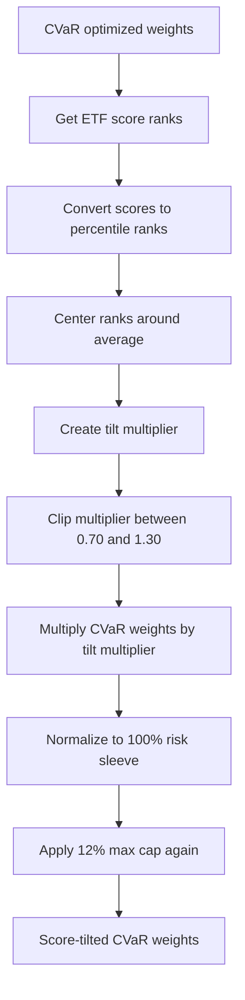

## What the score tilt does

Higher-ranked ETFs get a modest boost. Lower-ranked ETFs get a modest haircut.

Config:

```python
SCORE_TILT_STRENGTH = 0.35
SCORE_TILT_MIN_MULTIPLIER = 0.70
SCORE_TILT_MAX_MULTIPLIER = 1.30
```

So the score model influences sizing, but it does not overpower Riskfolio.

---

# 10. Cash sleeve logic

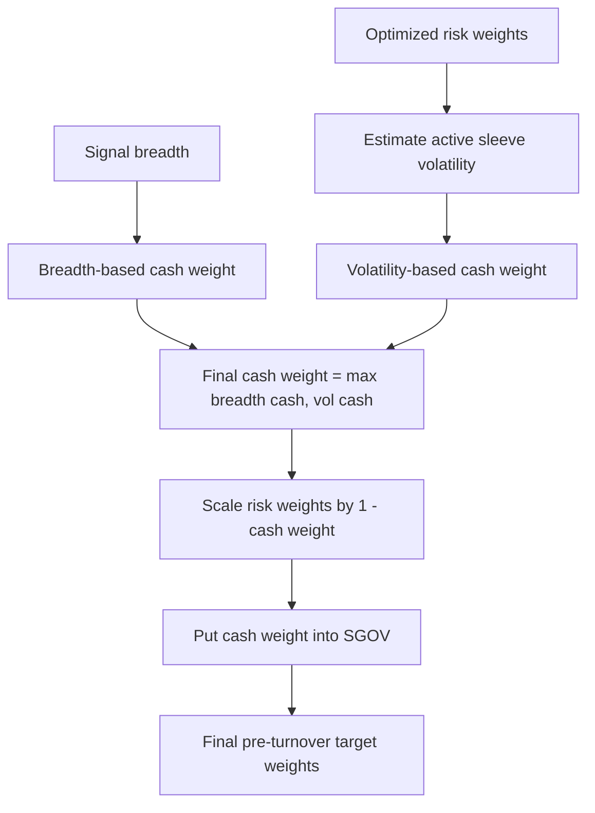

## Cash comes from two sources

### 1. Signal breadth cash

The script checks how broad the market strength is across the ETF universe.

It measures:

```text
How many ETFs are above SMA50?
How many are above SMA126?
How many have positive 63D momentum?
How many have positive 126D momentum?
Plus SPY confirmation
```

If breadth is weak, it raises SGOV.

### 2. Volatility cash

The script estimates the volatility of the selected risk sleeve.

If active sleeve volatility is above the target:

```python
TARGET_ACTIVE_SLEEVE_VOL = 0.18
```

then it adds SGOV to bring portfolio risk down.

Final cash weight is:

```python
cash_weight = max(breadth_cash_weight, vol_cash_weight)
```

So either weak breadth or high volatility can increase SGOV.

---

# 11. Turnover and pruning

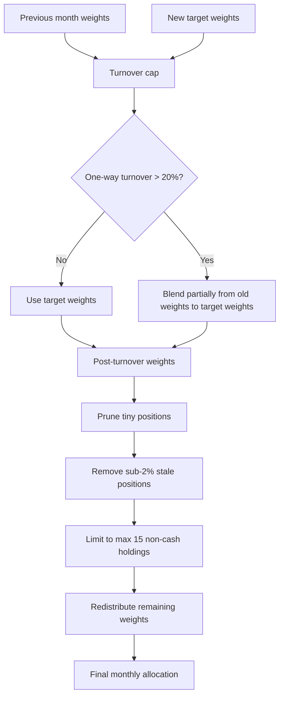

## Turnover formula

The script uses one-way turnover:

```python
turnover = 0.5 * sum(abs(current_weight - previous_weight))
```

With:

```python
MAX_TURNOVER_PER_REBALANCE = 0.20
```

So the portfolio only moves partway toward the new target if the trade would exceed 20% turnover.

## Why pruning exists

Turnover caps can leave tiny stale positions. So after turnover control, V5.16 prunes tiny weights:

```text
Remove small positions below 2%
Keep max 15 non-cash holdings
Redistribute weight to the remaining names
```

This keeps the final allocation tradable.

---

# 12. Backtest return calculation

```mermaid
sequenceDiagram
    participant Loop as Monthly Loop
    participant Weights as Final Monthly Weights
    participant Returns as Daily Returns
    participant Backtest as Portfolio Return Engine

    Loop->>Weights: Final allocation at rebalance date
    Loop->>Returns: Get daily returns until next rebalance
    Returns->>Backtest: forward_returns matrix
    Weights->>Backtest: final_weights vector
    Backtest->>Backtest: daily portfolio return = returns dot weights
    Backtest->>Loop: Append daily returns
```

## Core idea

At each monthly rebalance:

```python
period_portfolio_returns = forward_returns.dot(final_weights)
```

This means:

```text
The selected weights are held until the next monthly rebalance.
```

That is why V5.16 is a monthly production engine, not a weekly risk-off engine.

---

# 13. Output/reporting block

```mermaid
flowchart TD
    A[Daily strategy returns] --> B[Equity curve]
    A --> C[Benchmark comparison]
    A --> D[Monthly returns]
    A --> E[Worst months]
    A --> F[Rolling 12M underperformance]
    A --> G[Drawdown table]

    H[Weights by rebalance] --> I[Final target weights]
    H --> J[Tradeable final target weights]
    H --> K[Turnover report]

    L[Score and eligibility history] --> M[Final selection reasons]
    L --> N[Eligibility history]

    O[Final portfolio] --> P[Final correlation matrix]
    O --> Q[High correlation pairs]
    O --> R[Correlation heatmap]
```

## Important output files

```text
walk_forward_summary.csv
benchmark_comparison_by_window.csv
rolling_12m_summary_by_window.csv

walk_forward_windows/2023/final_target_weights_tradeable.csv
walk_forward_windows/2023/final_portfolio_selection_reasons.csv
walk_forward_windows/2023/weights_by_rebalance.csv
walk_forward_windows/2023/signal_cash_history.csv
walk_forward_windows/2023/turnover_by_rebalance.csv
walk_forward_windows/2023/benchmark_comparison.csv
walk_forward_windows/2023/monthly_returns.csv
walk_forward_windows/2023/worst_months.csv
walk_forward_windows/2023/drawdown_data.csv
```

---

# 14. End-to-end simplified sequence

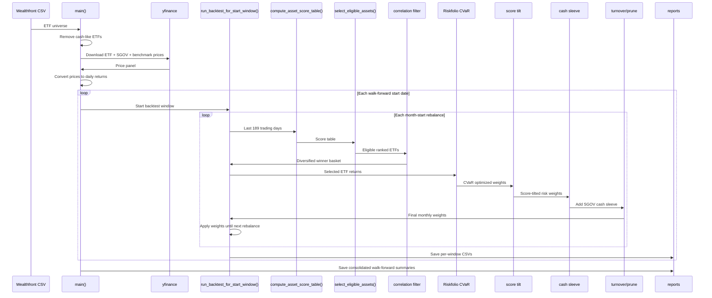

---

# 15. One-sentence explanation for someone else

V5.16 is a **monthly tactical ETF rotation system** that reads the Wealthfront ETF universe, downloads price data, ranks ETFs by trend/momentum/volatility, removes weak and highly correlated names, uses Riskfolio CVaR to size the selected basket, modestly tilts weights toward stronger scores, adds SGOV when breadth or volatility says risk is elevated, caps turnover, prunes small positions, and then holds the portfolio until the next month-start rebalance.
